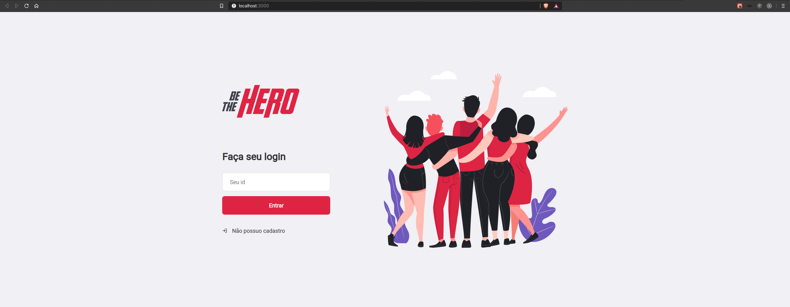
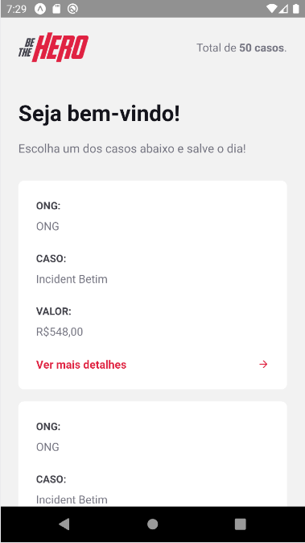

<h1>

<strong>be-the-hero</strong>

</h1>

#### :rocket: Semana OmniStack 11.0

 
<a href="web">Frontend</a> |
<a href="backend">Backend</a> |
<a href="mobile">Mobile</a>

Seja o herói!

Essa é a minha implementação do projeto da Semana OmniStack 11.0: **be-the-hero**

# :computer: Techs

- [Node](https://nodejs.org)
- [React](https://reactjs.org)
- [React Native](https://reactnative.dev)
- [Expo](https://expo.io)

# :hammer: Como baixar o projeto?

Execute os seguintes comandos em seu terminal:

- `git clone git@github.com:LorenzooG/be-the-hero.git`
- `cd be-the-hero`

Pronto! Agora o projeto está em seu computador.

# Como fazer build do projeto?

Depois de baixado e dentro da pasta execute:

- `cd frontend`
- `npm install`
- `npm build`
- `cd ..`
- `cd backend`
- `cd npm build`

Pronto! Se quiser iniciar, entre na pasta do sub-projeto e digite: `npm start`

# :memo: Licença

Este projeto utiliza a licença MIT. Confira [aqui](LICENSE)
